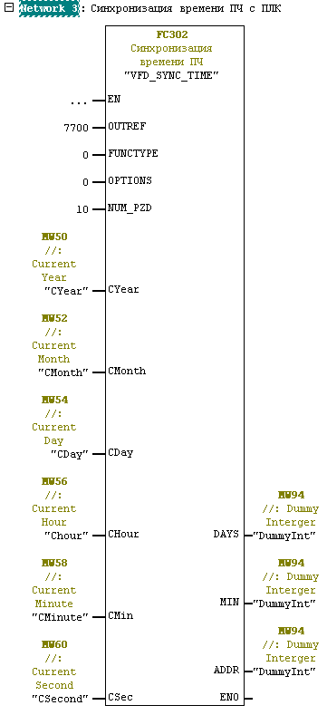
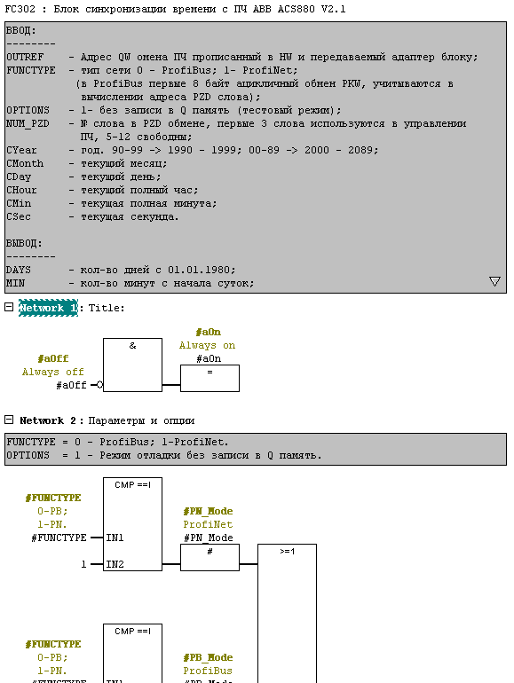

# Синхронизация времени ПЧ ABB ACS880 с ПЛК Siemens

## Описание решения:

Один из способов синхронизации времени ПЧ
Запись в параметры ПЧ:
* 96.24 колличество дней с 01.01.1980;
* 96.25 колличество минут с начала суток;
* 96.26 колличество милисекунд с начала минуты.

ПЧ раз в минуту проверяет данные параметры и если они изменились обновляет по 
ним внутренние часы, 
т.е. если  96.25  задать 60, то часы отобразят 1:00 и далее будут идти от 
данной уставки до следующего изменения значения параметра. Сбой связи с 
частотником не влияет на работу, часы продолжают идти с момента (времени) 
последней синхронизации.

Парамет 96.24 содержит устанавливаему дату в днях с 01.01.1980

ProfiBus (модуль ПЧ FPBA) обмен ПЛК с ПЧ состоит из 2х частей: 
1. первые 4 слова PKW - ацикличный обмен, где каждую итерацию ПЛК 
    запрашивает/записывает значение одного параметра по его номеру;
1. 12 слов PZD (в случае PPO7) - постоянно отправляются в ПЧ, принимаются ПЛК.
 
    Для управления, в посылке от ПЛК к ПЧ, используются первые 4 слова,
    с 6 -по 12 свободны. 

В ProfiNet (модуль ПЧ FENA) нет PKW части.

Для синхронизации времени можно использовать свободные PZD слова 5-12.
Далее в примере используются слова 10-12.

Со стороны ПЧ:
   - привязать данные приходящие в 10 слове в ПЧ с параметром текущей даты, для 
     этого в  53.10 выбрать параметр 96.24;
 
   - привязать данные приходящие в 11 слове в ПЧ с параметром времени (минуты   
 
     с начала суток), для этого в  53.11 выбрать параметр 96.25.
   
   - привязать данные приходящие в 12 слове в ПЧ с параметром времени          
     (милисекунды текущей минуты), для этого в  53.12 выбрать параметр 96.26.

Со стороны ПЛК, после адаптер блока, добавить данную функцию, параметрировать:
   - OUTREF    - указать адрес QW обмена с ПЧ;
   - FUNCTYPE  - 0 - ProfiBus; 1 - ProfiNet;
   - NUM_PZD   - 10;
   - CYear     - текущий год
   - CMonth    - текущий месяц
   - CDay      - текущий день
   - CHour     - текущий полный час;
   - СMin      - текущая полная минута;
   - СSec      - текущая секунда в минуте;
   
## Железо
FC блок создан и тестировался под ПЛК S7 400 в Step7 v5.5 +SP4.
Синхронизация с ПЧ ABB ACS880 c управлением по ProfiBus и ProfiNet.
-------

